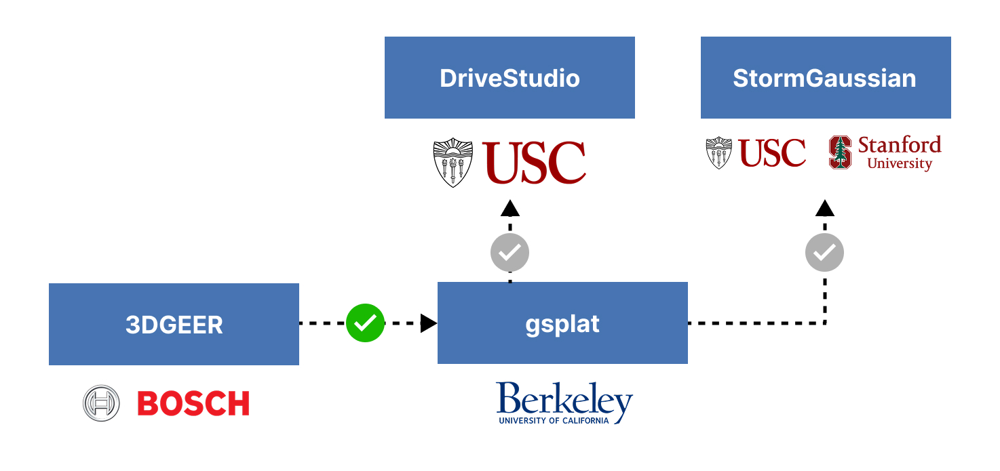

<p align="center">

  3DGEER supports the opensource community with <code>gsplat</code> integration.
</p>

# How to use `gsplat-geer` in your project
If you are using `gsplat==1.5.3` in your project, it is a simple replacement.

1. Uninstall `gsplat` (if necessary).
```bash
pip uninstall gsplat
```
2. Clone this branch (anywhere on your system).
```bash
git clone --branch gsplat-geer --single-branch https://github.com/boschresearch/3dgeer.git
cd 3dgeer
```

3. Install dependencies (if necesary). `gsplat-geer` has been confirmed to work with CUDA 12.1 and PyTorch 2.4.1. Other dependencies can be found in `examples/requirements.txt`
```
pip install torch==2.4.1
pip install -r examples/requirements.txt
```

4. Install `gsplat-geer`.
```bash
cd 3dgeer
pip install -e . --no-build-isolation
```

5. Compile C++ library
```bash
python setup.py develop
```

6. Set the `with_geer` and `with_eval3d` flags to `True` in your `gsplat` `rasterization()` function call.
```python
with_geer=True, with_eval3d=True
```
